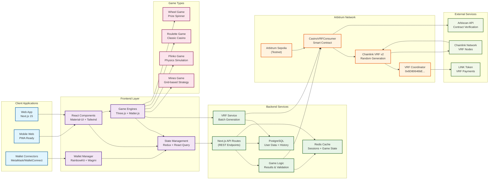

# APT Casino - System Architecture Diagram

## 🎯 Architecture Components

### Client Layer
- **Web App**: Next.js 15 with App Router for modern web experience
- **Mobile Web**: PWA-ready responsive design for mobile users
- **Wallet Connectors**: Support for MetaMask, WalletConnect, and other Web3 wallets

### Frontend Layer
- **React Components**: Material-UI and Tailwind CSS for modern UI/UX
- **Game Engines**: Three.js for 3D graphics, Matter.js for physics simulation
- **State Management**: Redux Toolkit with React Query for efficient data management
- **Wallet Manager**: RainbowKit and Wagmi v2 for seamless wallet integration

### Backend Services
- **Next.js API Routes**: RESTful endpoints for game operations
- **VRF Service**: Batch random number generation management
- **Game Logic**: Result validation and game state management
- **PostgreSQL**: Persistent storage for user data and game history
- **Redis Cache**: High-performance caching for sessions and game states

### Blockchain Layer
- **Arbitrum Sepolia**: Layer 2 testnet for development and testing
- **CasinoVRFConsumer**: Custom smart contract for casino operations
- **Chainlink VRF v2**: Verifiable random function for provably fair gaming
- **VRF Coordinator**: Chainlink's coordinator contract for VRF requests

### Game Types
- **Mines**: Strategic grid-based game with hidden mines
- **Plinko**: Physics-based ball drop game with multipliers
- **Roulette**: Classic casino roulette with multiple betting options
- **Wheel**: Customizable prize wheel with various segments

### External Services
- **Chainlink Network**: Decentralized oracle network for randomness
- **Arbiscan API**: Blockchain explorer for contract verification
- **LINK Token**: Payment token for Chainlink VRF services

## 🔄 Data Flow Summary

1. **User Interaction**: Users interact through web/mobile clients
2. **Wallet Connection**: RainbowKit manages wallet connectivity
3. **Game Selection**: Frontend routes to specific game engines
4. **VRF Request**: Backend triggers smart contract for randomness
5. **Blockchain Processing**: Chainlink VRF generates verifiable random numbers
6. **Result Processing**: Smart contract processes results and emits events
7. **State Update**: Frontend updates game state and user interface
8. **Data Persistence**: Results stored in PostgreSQL with Redis caching

## 🛡️ Security Features

- **Provably Fair Gaming**: Chainlink VRF ensures cryptographically secure randomness
- **Smart Contract Security**: Access controls and treasury-only functions
- **Wallet Security**: Non-custodial design with user-controlled private keys
- **Network Security**: Arbitrum's Layer 2 security inherited from Ethereum