# APT Casino - Mermaid Architecture Diagrams

## 🏗️ System Architecture Overview

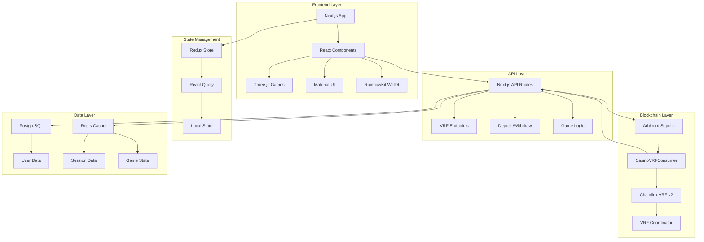

## 🔄 Application Bootstrap Flow

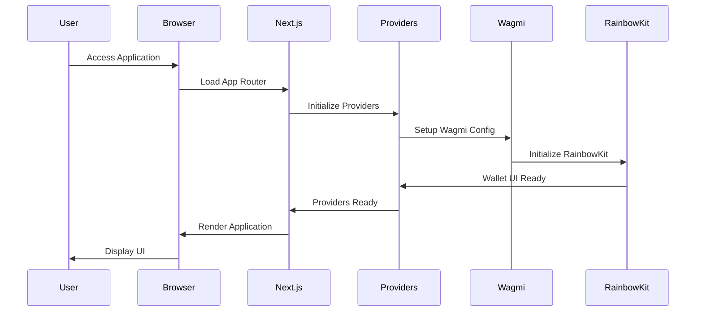

## 🔗 Wallet Connection Flow

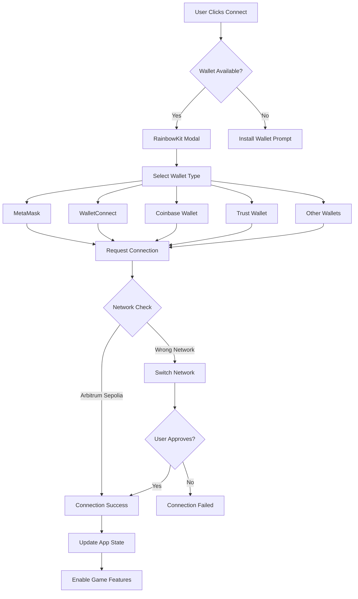

## 🎲 VRF Integration Architecture

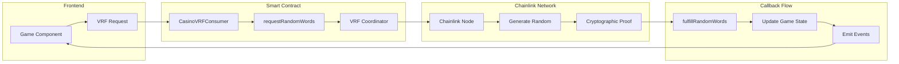

## 🎮 Game Execution Flow

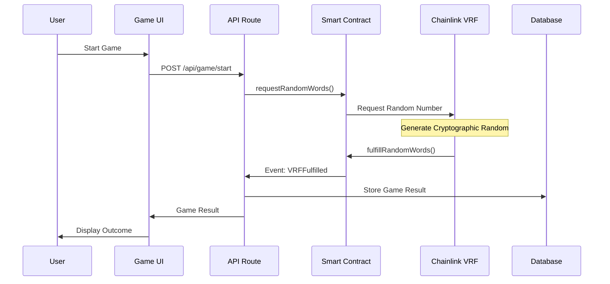

## 🏗️ Smart Contract Deployment Flow

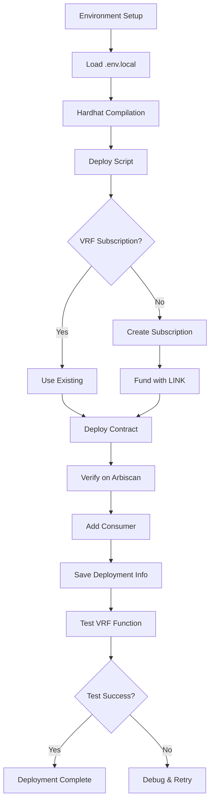

## 🎯 Game-Specific Flows

### Mines Game Flow
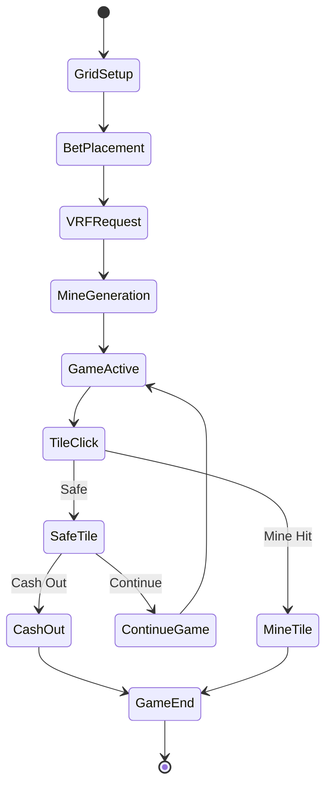

### Plinko Game Flow
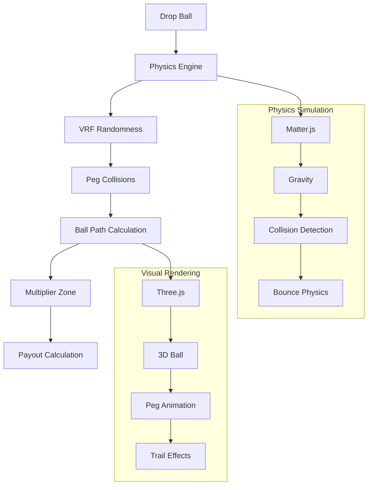

### Roulette Game Flow
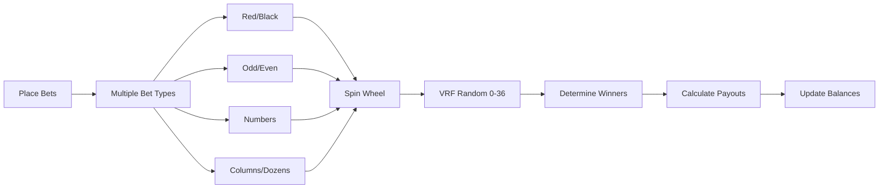

## 🔐 Security & Access Control

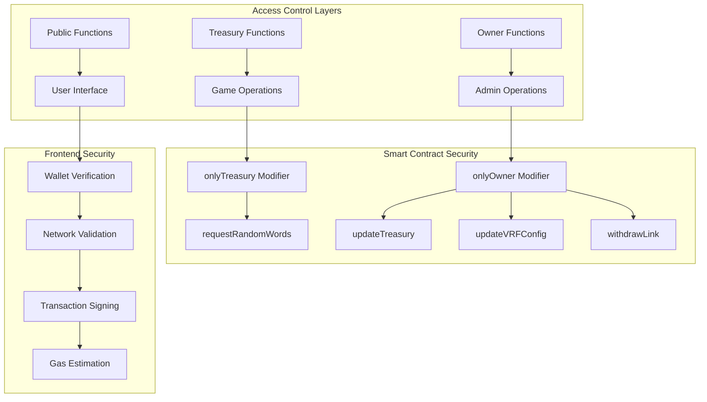

## 📊 Data Flow Architecture

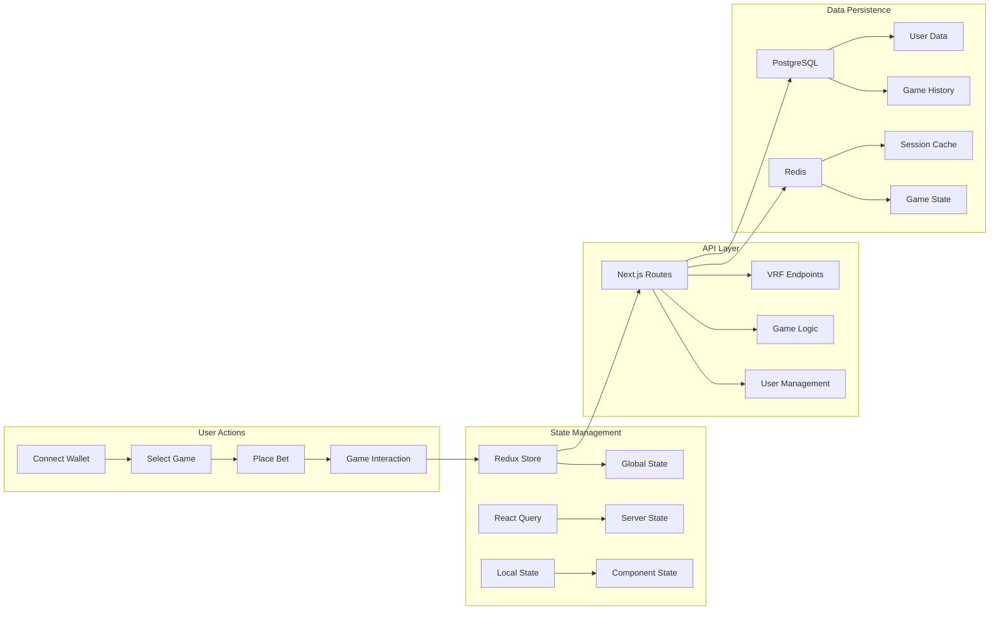

## 🚀 Deployment Pipeline

```mermaid
gitGraph
    commit id: "Initial Setup"
    branch development
    checkout development
    commit id: "Smart Contracts"
    commit id: "Frontend Components"
    commit id: "API Routes"
    
    branch feature/vrf-integration
    checkout feature/vrf-integration
    commit id: "VRF Setup"
    commit id: "Game Logic"
    
    checkout development
    merge feature/vrf-integration
    commit id: "Integration Tests"
    
    branch staging
    checkout staging
    merge development
    commit id: "Staging Deploy"
    commit id: "User Testing"
    
    checkout main
    merge staging
    commit id: "Production Deploy"
    commit id: "Mainnet Contracts"
```

## 🔄 Request-Response Cycle

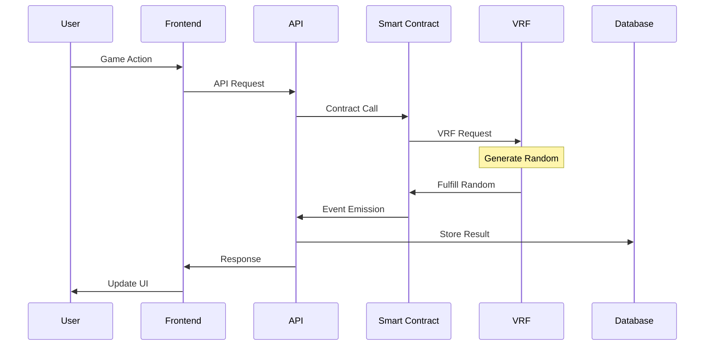

## 🎨 Frontend Component Architecture

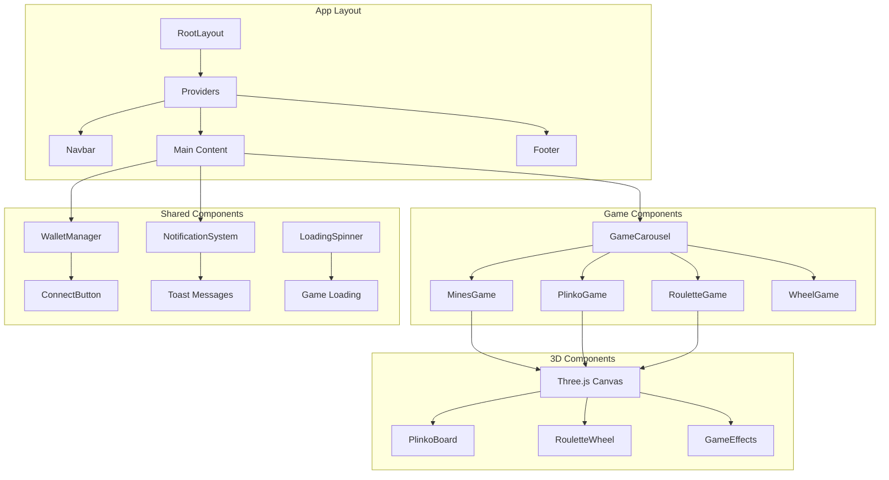

## 🔧 Development Workflow

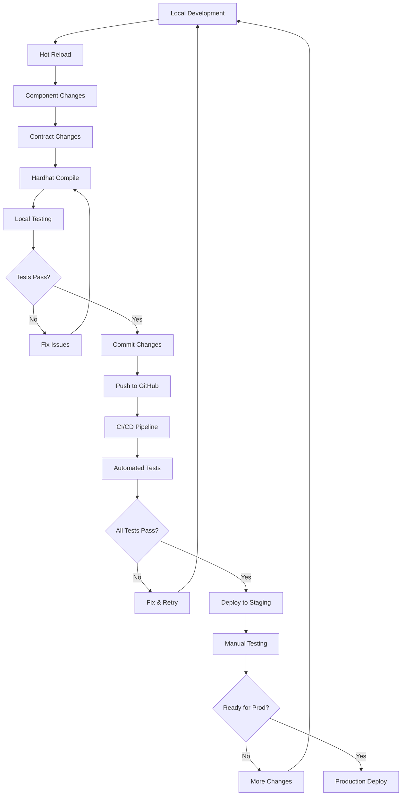

## 📈 Performance Monitoring

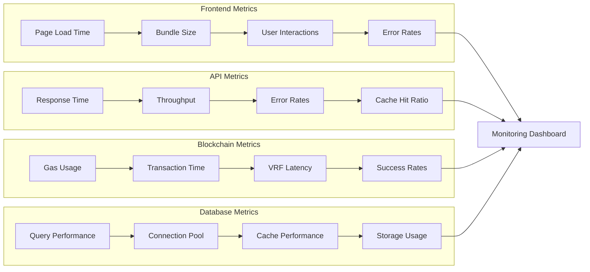

## 🎯 User Journey Flow

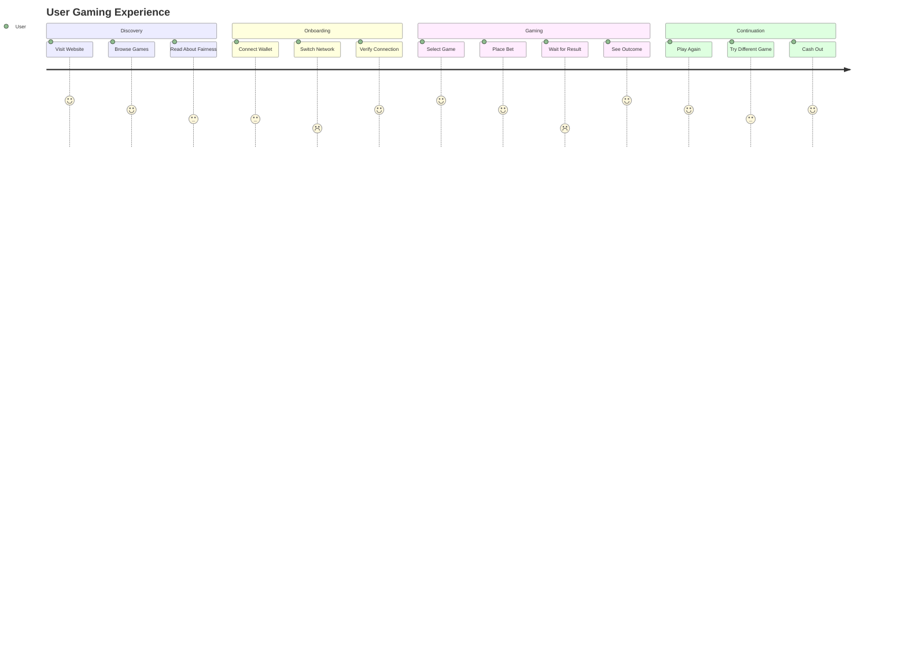

This comprehensive set of Mermaid diagrams provides visual representations of all major architectural components and flows in the APT Casino application, making it easier to understand the complex interactions between different system layers.