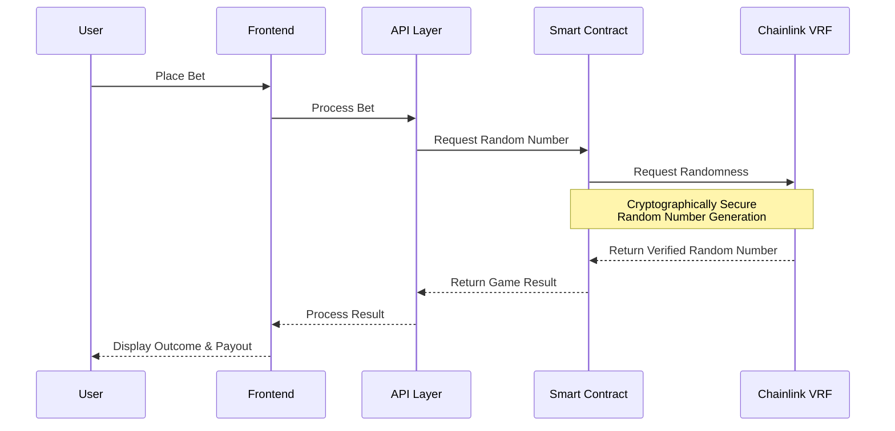
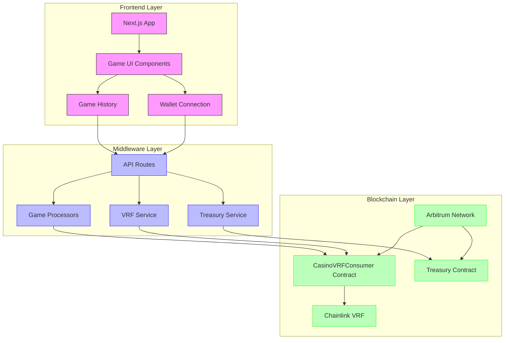
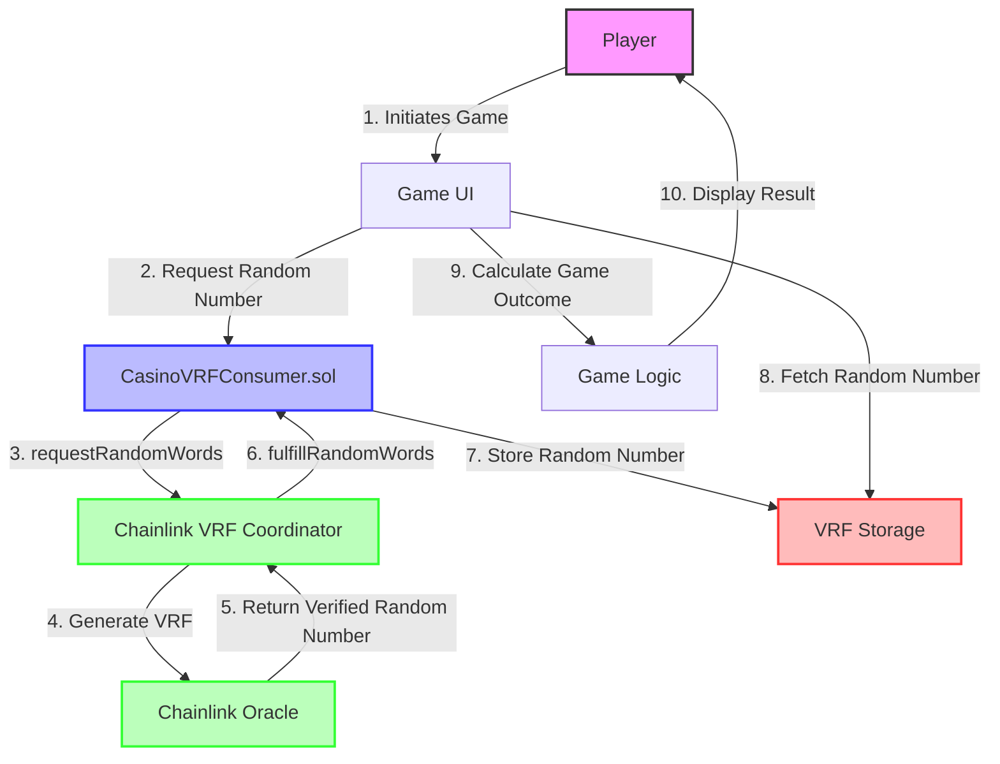
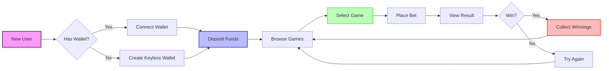

# 🎮 APT-Casino: A hyper-composable, Fully On-Chain, Provably-Fair Casino 

A couple of days back, I was was on etherscan exploring some transactions and saw an advertisement of [https://stake.com/](url) which was giving 200% bonus on first deposit, I deposited 120 USDT into stake.com they gave 360 USDT as total balance in their controlled custodial wallet and when I started playing casino games I was shocked to see that I was only able to play with $1 per game and was unable to increase the betting amount beyond $1 and when I tried to explore and play other games on the platform the issue was persisting, I reached the customer support and got to know that this platform has cheated me under the name of wager limits as I was using the bonus scheme of 200%.

When I asked the customer support for refund they showed a mathematical equation which says if refund then I have to play $12,300 worth of gameplay and this was a big shock for me. Thereby, In the hope of getting the deposited money back, I played the different games of stake.com like roulette, mines, spin wheel, etc, the entire night and lost all the money and time.

I was very annoyed of that's how Apt-Casino was born, gamblefi all in one platform where new web3 users can play games, perform gambling but have a safe, secure, transparent environment that does not scam any of their users. Also, I wanted to address common issues in traditional gambling platforms.

> **Revolutionizing GambleFi with Arbitrum L2 & Chainlink VRF**

<div align="center">
  
  <p><em>Next-Gen Decentralized Casino Powered by Cryptographic Randomness</em></p>
</div>

[](https://arbitrum.io/)
[](https://chain.link/vrf)
[](https://nextjs.org/)
[](https://vercel.com/)

## 🌟 PARADIGM SHIFT: WEB3 GAMBLING REIMAGINED

APT-Casino isn't just another blockchain gambling platform—it's a **hyper-composable, fully on-chain, provably-fair casino ecosystem** that fundamentally disrupts the traditional gambling industry's opacity. Born from the frustration with predatory Web2 gambling platforms that employ:

- ❌ Rigged outcomes manipulated behind closed doors
- ❌ Hidden wager limits designed to trap user funds
- ❌ Restrictive withdrawal policies with impossible conditions
- ❌ Deceptive "bonus schemes" with unrealistic wagering requirements

**APT-Casino introduces a zero-trust gambling protocol where mathematics replaces faith and cryptographic proofs eliminate uncertainty.**

## 🔥 CORE TECHNOLOGICAL INNOVATIONS

### ⚡ Chainlink VRF-Powered Randomness Engine

Our platform leverages **Chainlink VRF v2.5 on Arbitrum Sepolia** to generate ungameable, entropy-rich randomness with cryptographic guarantees:

```
Confirmation Time Calculation:
• Chainlink VRF → Requires 6 block confirmations
• Arbitrum block time ≈ 0.25s
• Total randomness generation time = 6 × 0.25s = 1.5s
```

This means your roulette wheel resolves in under 2 seconds, with trustless fairness guaranteed by cryptographic proofs anchored to the Ethereum L1. **This is not just RNG. This is L2-synchronized, L1-verified entropy injection.**

### 🌐 Zero-Friction UX Architecture

- **Gasless Meta-Transactions**: Players never touch MetaMask popups; gas is abstracted via a meta-transaction relayer funded by our treasury
- **Keyless Authentication**: Seamless login via Google/Apple OAuth + traditional wallet connections


- **Non-Custodial Asset Management**: Zero custody of user funds—all balances are on-chain escrows

### 🔐 Cryptoeconomic Security Framework

- **L1-Anchored Randomness**: VRF proofs are Ethereum L1-verifiable, removing any chance of manipulation even at validator level
- **Transparent Treasury**: All casino operations funded through a transparent treasury contract at `0xb424d2369F07b925D1218B08e56700AF5928287b`
- **Composable Game Primitives**: Modular contracts for Roulette, Mines, Plinko, Spin Wheel, enabling a casino-as-a-protocol ecosystem

## 🎲 GAME SUITE: CRYPTOGRAPHICALLY SECURED ENTERTAINMENT

### 🎮 Game Logic Sequence



### 🎯 Roulette
- **Supported Bets**: Straight, Split, Street, Corner, Line, Dozen, Column, Red/Black, Odd/Even, High/Low
- **RNG**: VRF-seeded spin
- **Max Payout**: 35:1

### 💣 Mines
- **Grid**: 5×5, up to 24 mines
- **Compounding multipliers** per safe reveal
- **Player can cashout early** at any time

### 🔵 Plinko
- **Balls dropped through VRF-determined paths**
- **Multipliers**: 0.2× → 100× depending on depth and slot

### 🎡 Spin Wheel
- **Configurable risk**: Low (1.2×-2×), Medium (2×-5×), High (5×-20×)
- **Instant outcome** in ~1.5s

## 🛠️ TECHNICAL ARCHITECTURE

<div align="center">
  
</div>


### 🔄 System Architecture Diagram




### 🧠 System Components

```
src/
├── app/                    # Next.js app directory
│   ├── game/              # Game pages
│   │   ├── roulette/      # Roulette game
│   │   ├── mines/         # Mines game
│   │   ├── wheel/         # Wheel game
│   │   └── plinko/        # Plinko game
│   └── providers.js       # App providers
├── components/            # React components
├── hooks/                # Custom hooks for blockchain interaction
├── services/             # VRF and game services
├── lib/                  # Utilities and configurations
└── styles/               # Global styles

contracts/
├── CasinoVRFConsumer.sol  # Chainlink VRF consumer contract
```

### 🔄 Randomness Flow



The randomness flow demonstrates how APT-Casino ensures provably fair outcomes:

1. **Request**: Game initiates VRF request through `CasinoVRFConsumer.sol`
2. **Generation**: Chainlink VRF produces cryptographically secure random numbers
3. **Verification**: On-chain verification of VRF proof
4. **Consumption**: Game consumes verified randomness to determine outcome
5. **Transparency**: All steps verifiable on Arbitrum blockchain

## 🚀 DEVELOPMENT & DEPLOYMENT

### Frontend Development
```bash
# Start development server
npm run dev

# Build for production
npm run build

# Start production server
npm start

# Run linting
npm run lint
```

### Contract Development
```bash
# Compile contracts
npx hardhat compile

# Run tests
npx hardhat test

# Deploy to Arbitrum Sepolia
npx hardhat run scripts/deploy-vrf.js --network arbitrum_sepolia
```

### Environment Variables
```env
# Arbitrum Configuration
NEXT_PUBLIC_NETWORK=arbitrum_sepolia|arbitrum_one
NEXT_PUBLIC_VRF_CONTRACT_ADDRESS=your_vrf_contract_address

# Treasury
TREASURY_PRIVATE_KEY=your_treasury_private_key
TREASURY_ADDRESS=0xb424d2369F07b925D1218B08e56700AF5928287b

# Chainlink VRF
VRF_SUBSCRIPTION_ID=your_subscription_id
VRF_COORDINATOR=your_vrf_coordinator_address
```

## 🔐 CRYPTOGRAPHIC SECURITY MEASURES

### On-Chain Randomness
All games use Chainlink VRF randomness with:
- Cryptographic proof verification
- On-chain fulfillment
- Transparent request-response cycle

### Provably Fair Mechanics
- All game logic is on-chain
- Randomness is cryptographically verifiable
- No server-side manipulation possible
- Full transparency in outcome determination

### Smart Contract Security
- Reentrancy protection
- Input validation
- Proper error handling
- Event logging for transparency
- Treasury fund isolation

## 🌐 FUTURE ROADMAP: EXPANDING THE GAMBLEFI ECOSYSTEM

1. **Mainnet Launch** (Arbitrum One)
2. **Integration with CCIP** → Cross-chain casino liquidity + bets from Base, Optimism, Polygon
3. **AI-Powered Dealer Bots** → Agents that interact with players
4. **SocialFi Layer** → On-chain player chats, tipping with stablecoins
5. **NFT Player Profiles** → "Luck Streaks" minted as on-chain reputation assets

## 📱 CROSS-PLATFORM COMPATIBILITY

The application is fully responsive and optimized for:
- **Desktop**: Chrome, Firefox, Safari, Edge
- **iOS Safari**: Full support with native-like experience
- **Android Chrome**: Full support with optimized UI
- **Hardware wallets**: Ledger, Trezor integration
- **Software wallets**: MetaMask, Rainbow, Trust Wallet, etc.

### 🧭 User Journey Flow



## 📣 COMMUNITY TRACTION

APT-Casino has quickly gained significant traction in the Web3 community:

<div align="center">
  <a href="https://x.com/amaanbiz/status/1969349488033874149" target="_blank">
    
  </a>
</div>

Our [viral announcement](https://x.com/amaanbiz/status/1969349488033874149) generated:
- **11,000+ impressions** in just 24 hours
- **170+ likes** from Web3 enthusiasts
- **20+ retweets** spreading the vision
- **30+ comments** engaging with the concept

The overwhelming response demonstrates the strong market demand for transparent, provably fair gambling solutions on Arbitrum.

## 🌀 FINAL WORD

APT-Casino on Arbitrum is not just a casino. It's a **decentralized probability engine**, a **financialized entertainment protocol**, and a **GambleFi layer** redefining how risk, randomness, and rewards converge in Web3.

This is not gambling. This is mathematics you can verify, luck you can own, and trust you don't need.

- **Pitch Deck:** https://www.figma.com/deck/3TtaQDRChEZ6R2MhaKR94p/APT-Casino?node-id=1-1812&p=f&t=2pYGZfnc3x4KfjzM-1&scaling=min-zoom&content-scaling=fixed&page-id=0%3A1 
- **Demo Video:** https://youtu.be/kIEVCxtTdQc 
- **Pitch Video:** https://youtu.be/TYKBEi8JDHc 
- **X:** https://x.com/amaanbiz/status/1969349488033874149
